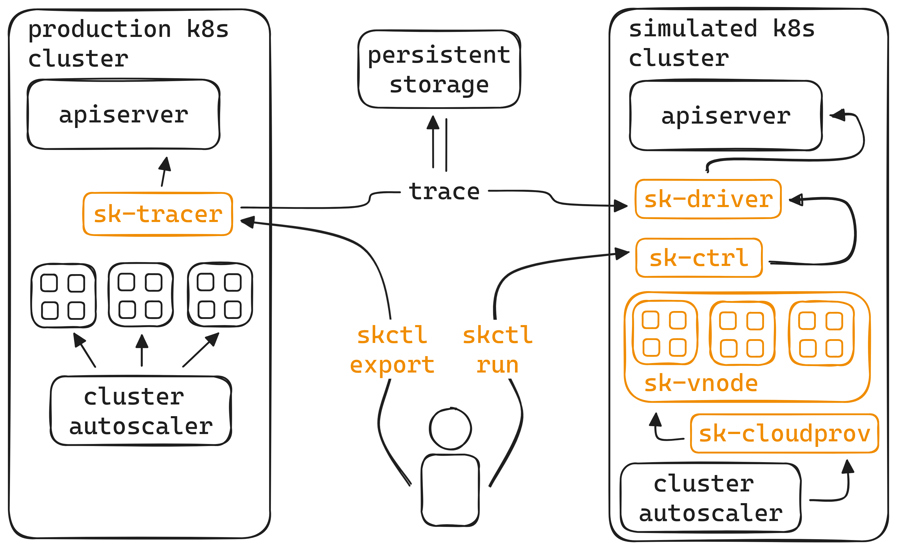

asdf

# simkube

A collection of tools for simulating Kubernetes scheduling and autoscaling behaviour

## Overview

This package provides the following components:

- `sk-cloudprov`: an [external gRPC-based cloud provider](https://github.com/kubernetes/autoscaler/tree/master/cluster-autoscaler/cloudprovider/externalgrpc)
  for Cluster Autoscaler that can communicate with and scale the `sk-vnode` "node group".
- `skctl`: a CLI utility for interacting with various other SimKube components
- `sk-ctrl`: a Kubernetes Controller that watches for Simulation custom resources and runs a simulation based on the
  provided trace file.
- `sk-driver`: the actual runner for a specific simulation, created as a Kubernetes Job by `sk-ctrl`
- `sk-tracer`: a watcher for Kubernetes pod creation and deletion events, saves these events in a replayable trace
  format.
- `sk-vnode`: a [Virtual Kubelet](https://virtual-kubelet.io)-based "hollow node" that allows customization based off a
  "skeleton" node file (see the example in `simkube/k8s/sk_vnode.py`).

Watch a demo of SimKube:

## Installation

### Prerequisites

- Go >= 1.20
- Rust >= 1.71 (needed if you want to build outside of Docker)
- Docker
- kubectl >= 1.27
- Kubernetes >= 1.27
- [CertManager](https://cert-manager.io) for setting up mutating webhook certificates

### Optional Prerequisites

SimKube uses [🔥Config](https://github.com/acrlabs/fireconfig) to generate Kubernetes manifests from definitions located
in `./k8s/`.  If you want to use this mechanism for generating Kubernetes manifests, you will need to install the
following additional dependencies:

- Python 3.10
- Python Poetry (https://python-poetry.org/docs/)

Additionally, if you want to run SimKube on a local development cluster, [kind](https://kind.sigs.k8s.io) >= 0.19 is the
supported tooling for doing so.

### Building

To build all SimKube artifacts for the first time run:
- `git submodule init && git submodule update`
- `make build` and `make skctl` from the root of this repository.

For all subsequent builds of SimKube artifacts, run only `make build` and `make skctl` from the root of this repository.

### Docker images

To build and push Docker images for all the artifacts, run `DOCKER_REGISTRY=path_to_your_registry:5000 make image`

### Deploying

You will need a KUBECONFIG file with cluster admin permissions; `make run` will use 🔥Config to generate the Kubernetes
manifests and deploy all SimKube artifacts to the specified cluster.

### Cleaning up

All build artifacts are placed in the `.build/` directory.  You can remove this directory or run `make clean` to clean
up.

## Documentation

You can find additional documentation  on the individual components in the [docs directory](./docs/) of this repo.
Links to relevant documentation are below:

- [sk-cloudprov](./docs/sk-cloudprov.md)
- [skctl](./docs/skctl.md)
- [sk-ctrl](./docs/sk-ctrl.md)
- [sk-driver](./docs/sk-driver.md)
- [sk-tracer](./docs/sk-tracer.md)
- [sk-vnode](./docs/sk-vnode.md)

## Contributing

We welcome any and all contributions to the SimKube project!  Please open a pull request.

If you have a feature request, please start a [discussion](https://github.com/acrlabs/simkube/discussions).  Members of
the SimKube team will determine whether the feature should become planned work and how it will be prioritized.

If you've found a bug or are working on a planned improvement, please [open an
issue](https://github.com/acrlabs/simkube/issues)!

### Code of Conduct

Applied Computing Research Labs has a strict code of conduct we expect all contributors to adhere to.  Please read the
[full text](./CODE_OF_CONDUCT.md) so that you understand the expectations upon you as a contributor.

### Copyright and Licensing

SimKube is licensed under the [MIT License](./LICENSE).  Contributors to this project agree that they own the copyrights
to all contributed material, and agree to license your contributions under the same terms.  This is "inbound=outbound",
and is the [GitHub default](https://docs.github.com/en/site-policy/github-terms/github-terms-of-service#6-contributions-under-repository-license).

> [!WARNING]
> Due to the uncertain nature of copyright and IP law, this repository does not accept contributions that have been all
> or partially generated with GitHub Copilot or other LLM-based code generation tools.  Please disable any such tools
> before authoring changes to this project.

### Contributor's Guide

Please see the [Contributor's Guide](./docs/contributing.md) for more information on setting up and building SimKube.
