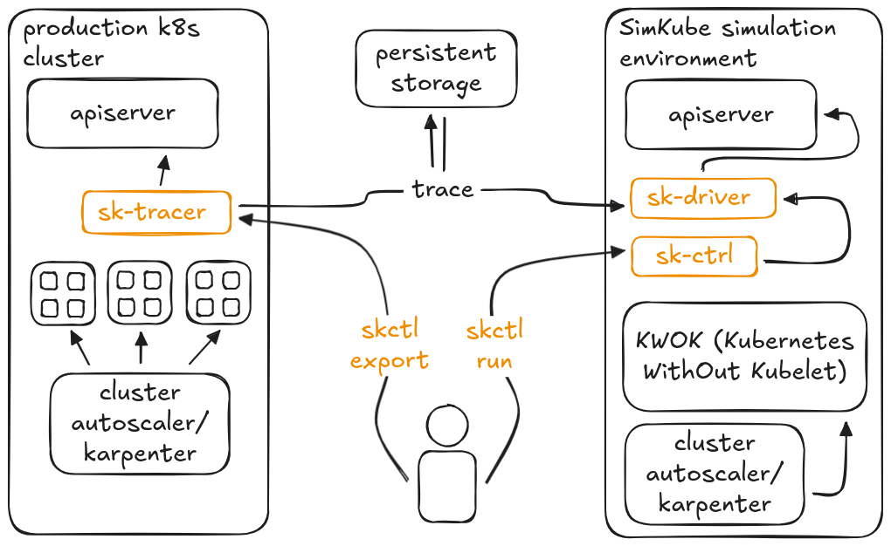

<!--
project: SimKube
description: |
  A collection of tools for saving and replaying running "traces" of a Kubernetes cluster in a simulated environment
template: docs.html
-->

A record-and-replay simulation environment for the Kubernetes control plane based on [KWOK](https://kwok.sigs.k8s.io).

## Overview

This package provides the following components:

- `skctl`: a CLI utility for interacting with various other SimKube components
- `sk-ctrl`: a Kubernetes Controller that watches for Simulation custom resources and runs a simulation based on the
  provided trace file.
- `sk-driver`: the actual runner for a specific simulation, created as a Kubernetes Job by `sk-ctrl`
- `sk-tracer`: a watcher for Kubernetes pod creation and deletion events, saves these events in a replayable trace
  format.

## Installation

1. To install `sk-tracer` in your prod cluster: `kubectl apply -k k8s/kustomize/prod`
2. To install `sk-ctrl` in your simulation cluster: `kubectl apply -k k8s/kustomize/sim`
3. To install `skctl` on your dev machine: `cargo install skctl`

## Documentation

Full [documentation for SimKube](https://simkube.dev/documentation/) is available on the SimKube website.
Here are some quick links to select topics:

- [Installation](https://simkube.dev/simkube/docs/intro/installation/)
- [Autoscaling](https://simkube.dev/simkube/docs/adv/autoscaling/)
- [Metrics Collection](https://simkube.dev/simkube/docs/adv/metrics/)
- [Developing SimKube](https://simkube.dev/simkube/docs/dev/contributing/)

### Architecture Diagram

## Community

We have a [channel](https://kubernetes.slack.com/archives/C07LTUB823Z) on the Kubernetes Slack instance!  Come chat with
us there.  (You can [sign up](https://communityinviter.com/apps/kubernetes/community) for the Kubernetes Slack instance
for free)

## Contributing

We welcome any and all contributions to the SimKube project!  Please open a pull request.

If you have a feature request, please start a [discussion](https://github.com/acrlabs/simkube/discussions).  Members of
the SimKube team will determine whether the feature should become planned work and how it will be prioritized.

If you've found a bug or are working on a planned improvement, please [open an
issue](https://github.com/acrlabs/simkube/issues)!

### Code of Conduct

Applied Computing Research Labs has a strict code of conduct we expect all contributors to adhere to.  Please read the
[full text](https://github.com/acrlabs/simkube/blob/main/CODE_OF_CONDUCT.md) so that you understand the expectations
upon you as a contributor.

### Copyright and Licensing

SimKube is licensed under the [MIT License](https://github.com/acrlabs/simkube/blob/main/LICENSE).  Contributors to
this project agree that they own the copyrights to all contributed material, and agree to license your contributions
under the same terms.  This is "inbound=outbound", and is the [GitHub
default](https://docs.github.com/en/site-policy/github-terms/github-terms-of-service#6-contributions-under-repository-license).

> [!WARNING]
> Due to the uncertain nature of copyright and IP law, this repository does not accept contributions that have been all
> or partially generated with GitHub Copilot or other LLM-based code generation tools.  Please disable any such tools
> before authoring changes to this project.

## Related Reading

- [Announcing SimKube 1.0](https://blog.appliedcomputing.io/p/announcing-simkube-v10)
- [Why do we need a simulator?](https://blog.appliedcomputing.io/p/simkube-part-1-why-do-we-need-a-simulator)
